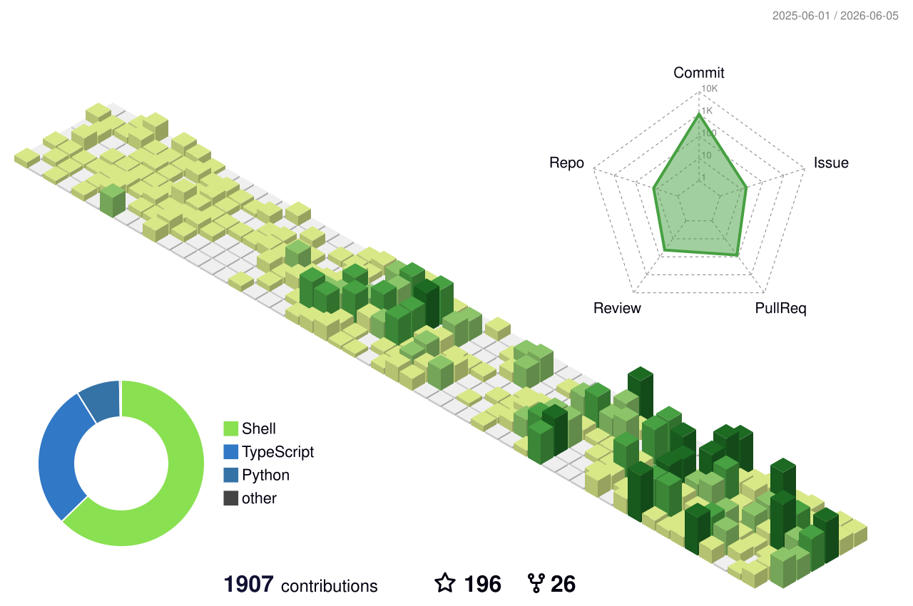

# Brandin Canfield

Senior software engineer · [Mile Two](https://www.miletwo.us/) · [brandincanfield.com](https://www.brandincanfield.com/)

<!-- pac-man eating the contribution graph (regenerated daily) -->
<picture>
  <source media="(prefers-color-scheme: dark)" srcset="https://raw.githubusercontent.com/bcanfield/bcanfield/output/pacman-contribution-graph-dark.svg">
  <source media="(prefers-color-scheme: light)" srcset="https://raw.githubusercontent.com/bcanfield/bcanfield/output/pacman-contribution-graph.svg">
  
</picture>

<!-- 3d isometric contribution calendar (regenerated daily) -->
<picture>
  <source media="(prefers-color-scheme: dark)" srcset="profile-3d-contrib/profile-night-view.svg">
  <source media="(prefers-color-scheme: light)" srcset="profile-3d-contrib/profile-green-animate.svg">
  
</picture>

<!-- top languages, transparent so it blends into both themes -->

### Lately

<!--START_SECTION:activity-->
1. ❌ Closed PR [#385](https://github.com/bcanfield/nextjs-pwa-webpush-template/pull/385) in [bcanfield/nextjs-pwa-webpush-template](https://github.com/bcanfield/nextjs-pwa-webpush-template)
2. ❌ Closed PR [#252](https://github.com/bcanfield/nextjs-pwa-webpush-template/pull/252) in [bcanfield/nextjs-pwa-webpush-template](https://github.com/bcanfield/nextjs-pwa-webpush-template)
3. ❌ Closed PR [#200](https://github.com/bcanfield/nextjs-pwa-webpush-template/pull/200) in [bcanfield/nextjs-pwa-webpush-template](https://github.com/bcanfield/nextjs-pwa-webpush-template)
4. ❌ Closed PR [#232](https://github.com/bcanfield/nextjs-pwa-webpush-template/pull/232) in [bcanfield/nextjs-pwa-webpush-template](https://github.com/bcanfield/nextjs-pwa-webpush-template)
5. ❌ Closed PR [#401](https://github.com/bcanfield/nextjs-pwa-webpush-template/pull/401) in [bcanfield/nextjs-pwa-webpush-template](https://github.com/bcanfield/nextjs-pwa-webpush-template)
<!--END_SECTION:activity-->
